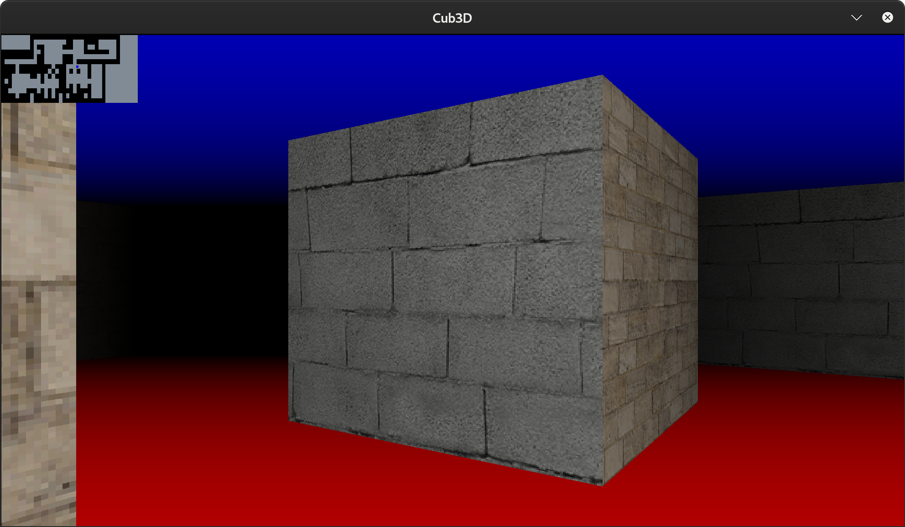
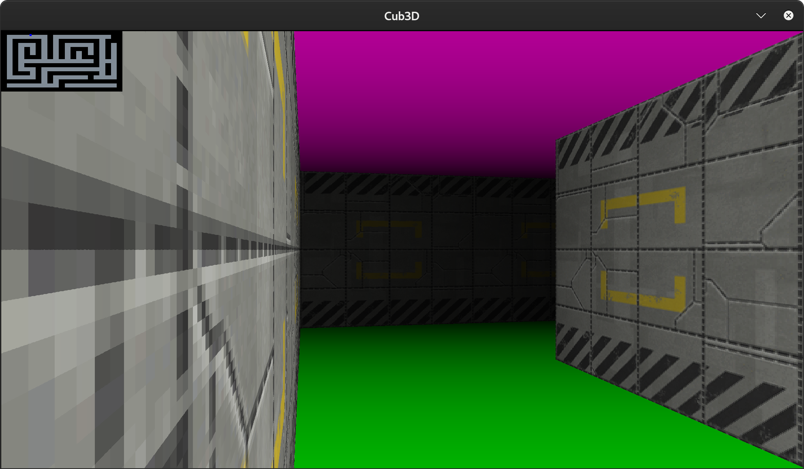

# Cub3D Project

## Introduction

This repository is dedicated to the Cub3D project, inspired by the historic game Wolfenstein 3D, which was the first FPS ever. The challenge of this project is to create a "realistic" 3D graphical representation of the inside of a maze from a first-person perspective, using Ray-Casting principles. The project is part of the 42 school curriculum and aims to explore graphics programming, deepen the understanding of algorithms for computer graphics, and how to deal with complex projects. The bonus part includes features such as collisions, a minimap, and fog of war, enhancing the game experience.

## Features

- 3D rendering of a maze using Ray-Casting.
- Texture mapping for walls and sprites.
- Basic controls to move forward, backward, and turn left and right.
- **Bonus**: Collision detection to prevent walking through walls.
- **Bonus**: Minimap for navigation.
- **Bonus**: Fog of war or depth shading to simulate distance visibility.

## Dependencies

Cub3D is developed in C and uses the MiniLibX graphics library, with the following dependencies:

- GCC or Clang compiler.
- Make (for compiling).
- MiniLibX library, provided by 42 or installed separately.
- A Unix-based operating system (Linux or MacOS).

## Installation

### Mandatory Part

To compile the mandatory part of Cub3D, follow these steps:

1. Clone the repository to your local machine:

```bash
git clone git@github.com:akhellad/Cub3D.git
```

2. Navigate to the cloned directory:

```bash
cd cub3D
```

3. Compile the project:

```bash
make
```

This will create an executable named `cub3D` for the mandatory part of the project.

### Bonus Part

For the bonus features including collisions, a minimap, and fog of war, compile with the following command:

```bash
make bonus
```

This command creates an executable named `cub3d_bonus`.

## Usage

To launch Cub3D, run:

```bash
./cub3D map.cub
```

For the bonus version, run:

```bash
./cub3d_bonus map.cub
```

Replace `map.cub` with the path to your map configuration file.

## Map Configuration

Ensure your map file (`map.cub`) is correctly formatted according to the project specifications. It should include the layout of the maze, textures for walls and sprites, and settings for ceiling and floor colors.

## Controls

- `W`, `A`, `S`, `D` to move the player forward, left, backward, and right.
- Left and right arrow keys to rotate the view (or mouse in bonus).
- `ESC` to exit the game.

## Screenshots

Here are some screenshots showcasing the gameplay and features of Cub3D:




## Credits

This project was developed by Akhellad and Hsilverb, students at Ecole 42. The Cub3D project demonstrates a practical application of computer graphics programming, offering an immersive experience in a 3D environment.

